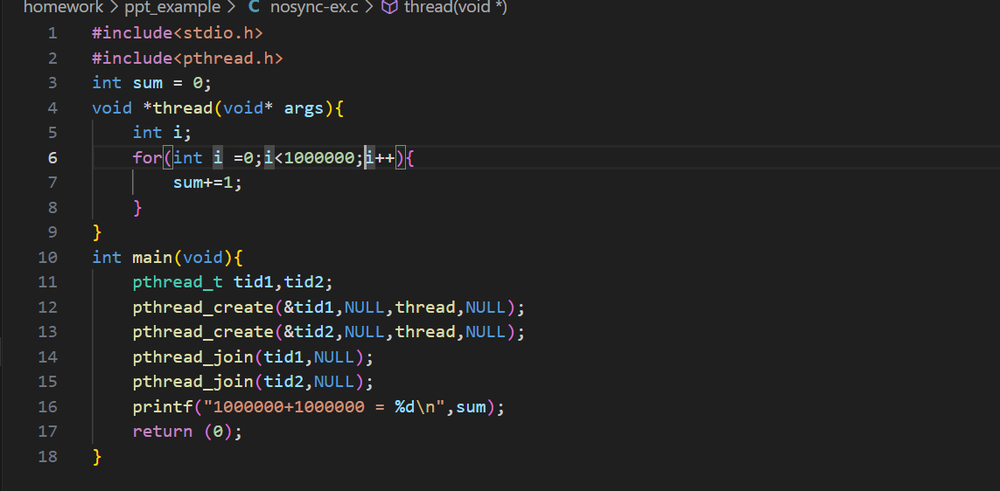
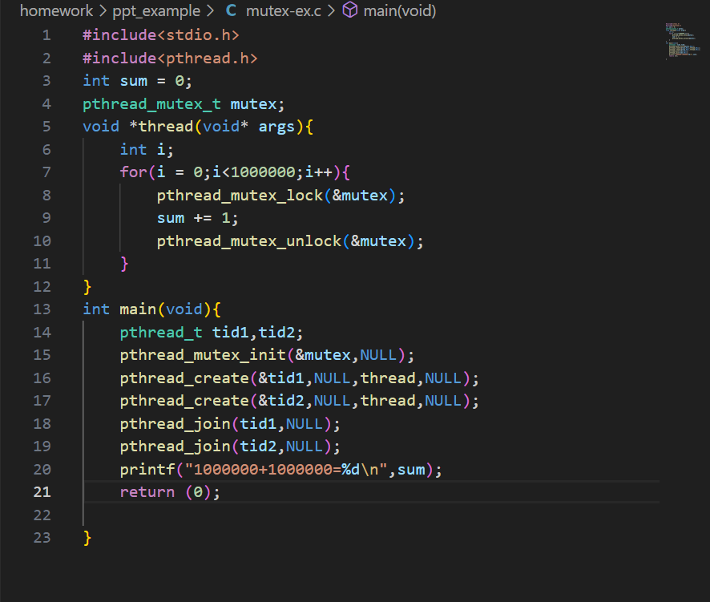
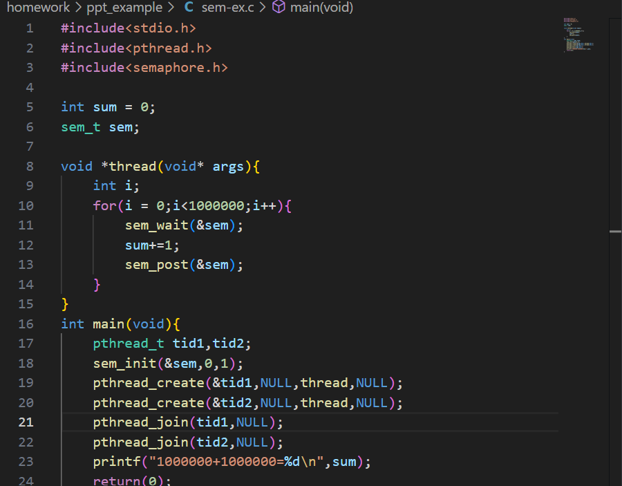
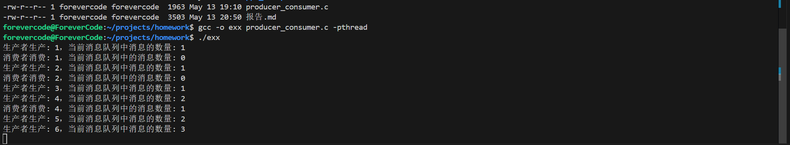

## 1.初始化
在实验开始阶段，实现要进行git仓库的初始化 git init,初始化git仓库后，即可进行项目的管理
首先，进行任务1的完成:实现课程ppt上的编程任务，编译并且运行
步骤如下：
git branch task01;从主分支master上拉取一个分支，进行编程
## 2.编程任务
ppt例子
    1.
    两个线程任务并发执行，由于基本数据类型int相加操作并不是原子性的，而是具有以下大致步骤：1.读取 2.相加 3.存储；因此会出现并发安全问题，导致数字相加的结果小于串行相加结果；
    2.
    通过互斥锁来解决并发安全问题，使得两个线程任务的执行串行执行
    3.
    使用信号量来保证多线程并发安全性，信号量可以控制访问共享数据的线程数量，设置访问数量为1，达到了互斥锁的作用效果
## 生产者消费者实验报告
## 一、实验目的

- 理解多线程之间的同步与互斥机制；
- 掌握生产者-消费者模型的原理；
- 学会使用 `pthread`、`mutex`、`condition variable` 编写线程安全的并发程序。

---

## 二、实验原理

### 1. 模型简介
- **生产者**负责向缓冲区中添加产品；
- **消费者**负责从缓冲区中取出产品；
- 两者共享一个**有限大小的缓冲区**；
- 为防止数据竞争与死锁，需要使用互斥锁与条件变量协调执行顺序。

### 2. 同步机制

- **互斥锁（`pthread_mutex_t`）**：保护共享资源；
- **条件变量（`pthread_cond_t`）**：
  - `not_full`：缓冲区满时生产者等待；
  - `not_empty`：缓冲区空时消费者等待。

---

## 三、实验环境

- 操作系统：Linux (Ubuntu 20.04+ 或 WSL)
- 编译器：GCC 9+
- 编译命令：`gcc -o pc producer_consumer.c -pthread`

---

## 四、源码（`producer_consumer.c`）

```c
#include <stdio.h>
#include <stdlib.h>
#include <pthread.h>
#include <unistd.h>

#define MAX_BUFFER_SIZE 5

int buffer[MAX_BUFFER_SIZE];
int count = 0;

pthread_mutex_t mutex = PTHREAD_MUTEX_INITIALIZER;
pthread_cond_t not_full = PTHREAD_COND_INITIALIZER;
pthread_cond_t not_empty = PTHREAD_COND_INITIALIZER;

void *producer(void *arg) {
    int item = 0;
    while (1) {
        item++;
        pthread_mutex_lock(&mutex);
        while (count == MAX_BUFFER_SIZE) {
            printf("缓冲区满，生产者等待...\n");
            pthread_cond_wait(&not_full, &mutex);
        }
        buffer[count++] = item;
        printf("生产者生产: %d，缓冲区中产品数: %d\n", item, count);
        pthread_cond_signal(&not_empty);
        pthread_mutex_unlock(&mutex);
        sleep(1);
    }
    return NULL;
}

void *consumer(void *arg) {
    int item;
    while (1) {
        pthread_mutex_lock(&mutex);
        while (count == 0) {
            printf("缓冲区空，消费者等待...\n");
            pthread_cond_wait(&not_empty, &mutex);
        }
        item = buffer[--count];
        printf("消费者消费: %d，缓冲区中产品数: %d\n", item, count);
        pthread_cond_signal(&not_full);
        pthread_mutex_unlock(&mutex);
        sleep(2);
    }
    return NULL;
}

int main() {
    pthread_t prod_tid, cons_tid;
    pthread_create(&prod_tid, NULL, producer, NULL);
    pthread_create(&cons_tid, NULL, consumer, NULL);
    pthread_join(prod_tid, NULL);
    pthread_join(cons_tid, NULL);
    return 0;
}



编译
gcc -o pc producer_consumer.c -pthread
./pc
运行结果
生产者生产: 1，缓冲区中产品数: 1
消费者消费: 1，缓冲区中产品数: 0
生产者生产: 2，缓冲区中产品数: 1
生产者生产: 3，缓冲区中产品数: 2
消费者消费: 2，缓冲区中产品数: 1

## 实验心得
通过本次实验，我深入理解了线程同步的本质，并熟悉了 pthread 库的使用方式。特别是条件变量的使用逻辑，学会了“等待-唤醒-保护”的三步走策略，对后续处理复杂多线程并发问题提供了良好基础。

